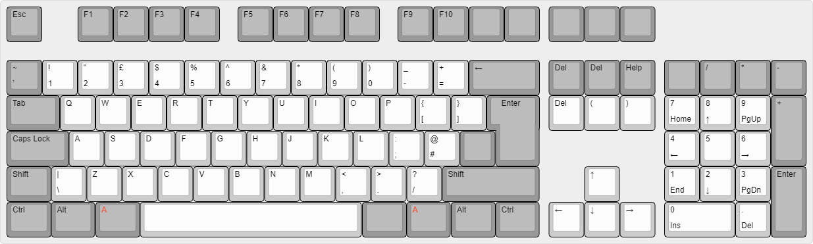
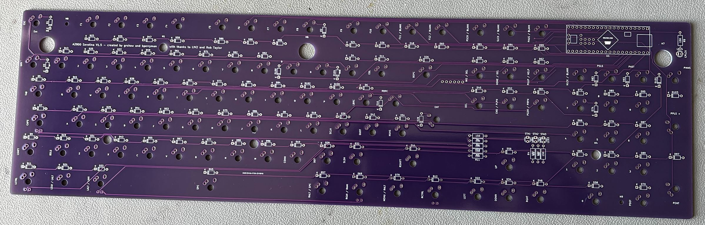
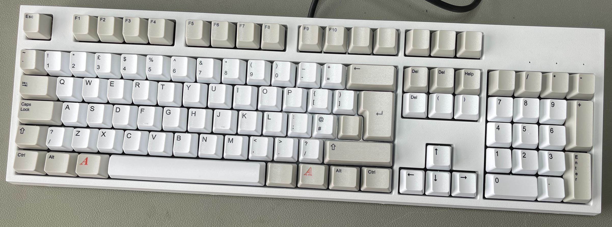
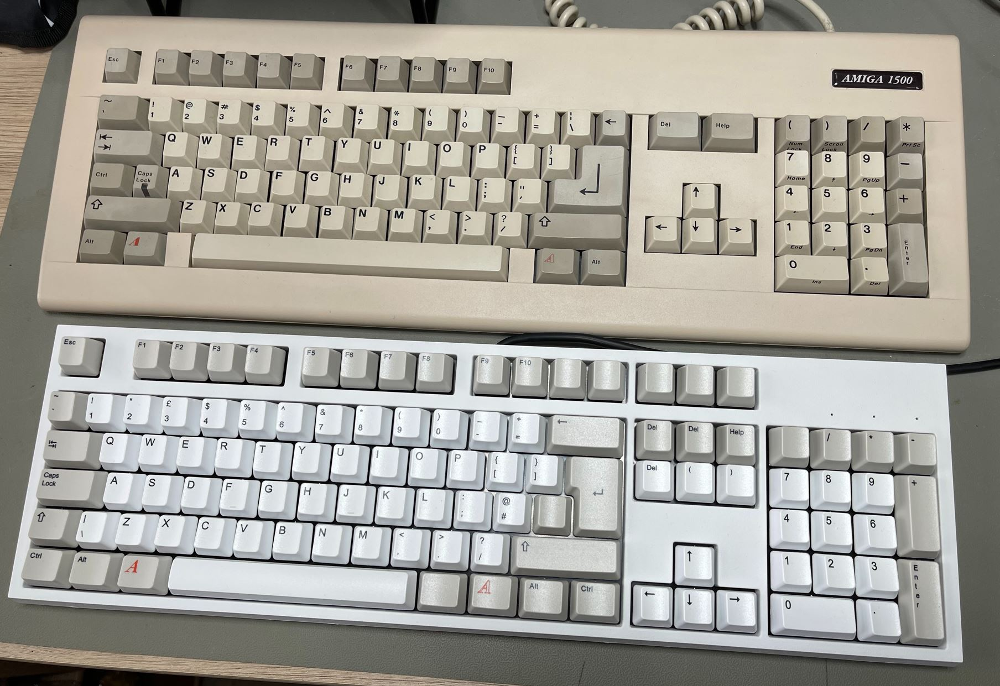

# A2000 Serotina Mechanical Keyboard

The A2000 Serotina Keyboard is a build it yourself Open Source Hardware Mechanical Keyboard for the Amiga A2000 and A3000 computers. Features are:

- Uses standard PC keyboard parts

- Uses standard PC keyboard case

- Supports using standard PC keycaps

- Allows the use of the WASD keycap printing service for Amiga specific keycaps

- All soldering is Through Hole - no SMD soldering required

- No original A2000 keyboard parts required

- All electronic components are still available to buy

- Uses an Arduino micro-controller

- Uses Cherry MX type switches

- Uses QMK firmware ( with Amiga specific code added )

- Multiple QMK keymaps supported for regional key variations

- Plugs directly in to an A2000 or A3000 using the 5 pin Din connector - no USB required

  

The keyboard layout for the UK keymap looks like this: 

The PCB for V1.5 looks like this: 

When the build is completed, V1.4 looks like this: 

A family portrait. The V1.4 Serotina keyboard with it's bigger brother and the inspiration for the project. 

