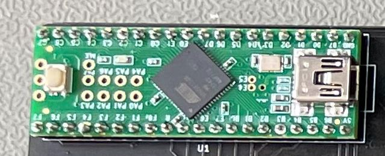
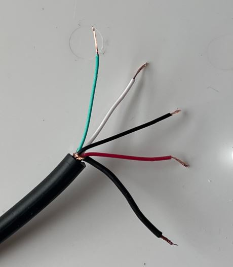
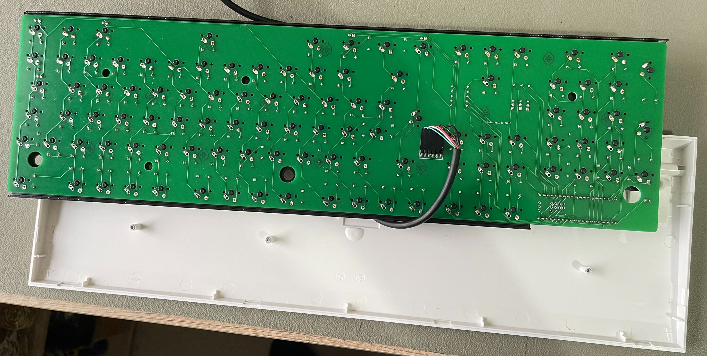

# A2000 Serotina Build Instructions

These instructions detail the build process step by step. 

### 1. Solder the Diodes

Solder Diodes D1 -> D105 to the front side of the PCB. Ensure that the polarity of the Diodes is correct. The black ring on the diode should match up to the marking on the PCB silk screen. 

### 2. Solder the Resistors

Solder the resistors R1 -> R12 to the front side of the PCB. Resistors R4 -> R6, R9 and R10 are for debug status LEDs, so you only need to populate these if you are planning to debug the keyboard.

### 3. Solder the Right Angled Pin Header

Solder the Right Angled Pin Header ( J1) to the back side of the PCB. Snip the third pin from the right.

### 4. Solder the Pin Headers onto the Teensy++ 2.0

Solder the Pin headers onto the Teensy++ 2.0 Arduino MCU. Using the PCB holes as a guide makes this process easier. Solder the pin in each corner first, followed by all of the others. 

### 5. Flash the firmware onto the Teensy++ 2.0

See here for instructions.

### 6. Solder the Teensy++ 2.0 onto the PCB

Solder the Teensy++ 2.0 onto the PCB.

### 7. Solder the LEDs to the PCB

Solder the LEDs to the front side of the PCB. LED1 -> 3, and LED6 -> 8 are only required for debugging. So you only need to populate these LEDs if you are planning to debug the keyboard. Remember, that the long leg on the LED is the positive one. There are two holes on the footprint for each LED. One hole is round and the other is square. The round hole is the positive hole, so you need to insert the longer of the two legs into the round hole. 

### 8. Line up Plate with PCB

Line up the PCB with the mounting plate and place switches in each of the corners. 

NB - you will need to bend the STA3 LED over a bit in order to fit under the mounting plate. This issue will be fixed in V1.5 of the PCB. 

### 9. Solder the first switches

Solder the switches inserted above. These will keep the PCB and the plate lined up whilst soldering the rest of the switches. 

### 10. Place the Cherry MX Switches

Push the Cherry MX switches into the holes in the mounting plate. If everything is lined up correctly, then the switches should just clip in. Solder one row at a time. 

### 11. Solder the Cherry MX Switches

Solder the Cherry MX Switches onto the PCB. Note that the footprints on the PCB are for both MX and Alps switches. This means that there are two holes for the right switch contact. You don't need to solder both holes, just the hole with the contact in it. However, you can solder both holes if you would prefer. Either is fine. 

### 12. Solder the in-swtich LEDs

Some keys have an LED mounted inside them. For example, Caps Lock. Put the LED in from the top of the switch and through the holes in the PCB. Once again, the longer leg must go through the round hole. 

Use White Tack / Blu Tack to hold the LED in place whilst you solder it from the other side. 

Switches which require LEDs are:

- Caps Lock
- Left Control
- Left Amiga
- Right Amiga
- Right Control

NB - Left Control, Right Control, Left Amiga and Right Amiga light up when pressed because these are the reset keys. If you don't want these keys to light up, then don't put an LED into these keys. You will certainly want an LED in the Caps Lock Key though. 

### 13. Drill The Keyboard Case

You will need to enlarge the hole in the keyboard case slightly, so that you can feed the 5 Pin Din connector into the hole. Using a 4.5mm Wood Drill bit, drill down, using the cable gutter as a guide. 

When you are done, the hole should look like this: 

You can now feed in the cable. There should still be some resistance. This is good, because it will provide some strain relief. 

You want approx. 20cm of cable to go inside the case.

### 14. Remove the Outer Insulation 

Cut off approx 25mm of insulation off the end of the cable using a craft knife. Careful not to cut too deep. If you do cut too deep, then you will cut through the shielding, which is used to carry one of the signals. 

Gather the copper insulation and twist into a wire. Remove the foil insulation. 

Put heat shrink over the newly wire and use a lighter or hot air to shrink. Also strip the top 3mm off all the other wires. 

NB - I had to use black heat shrink. It's the only one I have that is the correct size. That's not ideal, because there is already a black wire. I can still tell them apart because the heat shrink is thicker. However, if possible, choose a heat shrink colour which is different from the four other wires. 

### 15. Crimp Dupont connectors

Use a Dupont Crimping tool to put female connectors onto each wire. 

### 16. Insert the wires into a DuPont Plug

Insert the wires into a Six hole DuPont Plug, leaving the third hole empty. 

| DuPont Plug | 5 Pin Din | Signal   | Colour / Description |
| ----------- | --------- | -------- | -------------------- |
| 1           | 5         | Ground   | Green                |
| 2           | 4         | VCC      | White                |
| 3           |           |          | Leave Empty          |
| 4           | 1         | Not Used | Red                  |
| 5           | 3         | KCLK     | Black                |
| 6           | 2         | KDAT     | Shielding            |

NB - I chose to use this configuration for the DuPont Plug, because it matches the DuPont plug on the original A2000 Cherry keyboard. 

Also note, that the numbering on the 5 pin Din is probably not what you would expect. It's numbered as follows: 

### 17. Connect the PCB to the DuPont Plug

Turn the keyboard PCB upside down and connect your DuPont Plug to the PCB.

### 18. Connect to an Amiga and Test

The keyboard should look like this by now. 

It's now ready to connect to an Amiga and test it. I would recommend using Amiga Test Kit:

https://github.com/keirf/Amiga-Stuff/releases

Download and transfer the most recent version onto your Amiga. Press F2 to get to the Keyboard Test. Test each key by pressing it. You should be aiming for the following test result for the us_uk layout:

NB - for the International Layout, you would expect to see all keys as green, including the key to the right of left shift and also the key cut out from the Return key. 

### 19. Remove unwanted LED light guides

The case has light guides for three LEDs. The Amiga doesn't have a Num Lock or a Scroll lock key, so these LEDs are also not required. What's more, due to the positioning of the Teensy 2.0++ MCU, these light guides will prevent the case from being closed. It's necessary to remove the light guides from the case. Use you side cutters to cut the light guides into quarters and then eighths. Then use a pair of pliers to gently waggle the plastic until it comes off. The plastic is quite soft and will come away easily after a few waggles, without the need for force or pulling. 

Make sure you remove the correct two. You need to leave the one on the left as the case is upside down for guiding the Caps Lock LED. Look at where the LED is on the PCB if you are unsure. 

### 20. Attach the Stabilizers

Attach the stabilizers.

### 21. Fit Keycaps for Stabilized keys

There is a knack to fitting Costar stabilizers. Fit both the inserts into the key first. The longer part of the insert should be pointing towards the top of the keyboard for horizontal switches and the left of the keyboard for vertical switches. 

You can test by putting the keycap onto the switch and pushing down. If the keycap fits onto the switch stem and moves down okay, then you have the inserts fitted correctly. In order to fit onto the Stabilizer wire, put one side on as you move the keycap down and then push slightly to get the wire on the other side to clip into the insert. You can see a YouTube video about how to fit Costar stabilizers here: 

[]: https://www.youtube.com/watch?v=oWgrnQGBBn4&amp;ab_channel=iluvbeanz	"Lubing stabilizers (Costar and Cherry)"

### 22. Put on the Top Case

First rest the top case onto the top. There are three plastic posts that go into holes in the Mounting plate. Press the posts down first. Next, close all the clips. You should not need to press too hard. The plastic clips are quite fragile. If you press too hard, you might break them. 

### 22. Put on the rest of the Keycaps

You are all done now, just need to put the rest of the keycaps on. 

### 23. Final Test

And last thing is a final test. 

