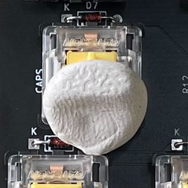

# A2000 Serotina Build Instructions

These instructions detail the build process step by step. 

### 1. Solder the Diodes

Solder Diodes D1 -> D105 to the front side of the PCB. Ensure that the polarity of the Diodes is correct. The black ring on the diode should match up to the marking on the PCB silk screen. 

### 2. Solder the Resistors

Solder the resistors R1 -> R12 to the front side of the PCB. Resistors R4 -> R6, R9 and R10 are for debug status LEDs, so you only need to populate these if you are planning to debug the keyboard.

### 3. Solder the Right Angled Pin Header

Solder the Right Angled Pin Header ( J1) to the back side of the PCB. Snip the third pin from the right.

### 4. Solder the Pin Headers onto the Teensy++ 2.0

Solder the Pin headers onto the Teensy++ 2.0 Arduino MCU. Using the PCB holes as a guide makes this process easier. Solder the pin in each corner first, followed by all of the others. 

### 5. Flash the firmware onto the Teensy++ 2.0

See here for instructions.

### 6. Solder the Teensy++ 2.0 onto the PCB

Solder the Teensy++ 2.0 onto back side of the PCB.

### 7. Solder the LEDs to the PCB

Solder the LEDs to the front side of the PCB. LED1 -> 3, and LED6 -> 8 are only required for debugging. So you only need to populate these LEDs if you are planning to debug the keyboard. Remember, that the long leg on the LED is the positive one. There are two holes on the footprint for each LED. One hole is round and the other is square. The round hole is the positive hole, so you need to insert the longer of the two legs into the round hole. 

### 8. Test Using tweezers

You should now have a keyboard that is functional. You can now test that all of the keys are working as they should using tweezers. Start a keyboard tester. For example: 

[Keyboard Tester]: https://www.keyboardtester.com/

Plug your keyboard into a PC using a mini USB cable connecting directly to the Teensy++ 2.0

### 9. Fix Stabilizers to PCB

Construct 6 x 2u stabilizers and 1 x 6.25u Stabilizers. Insert into the holes. The stabilizer end with the metal bar should go into the big hole. The screw should go into the small hole remember to put the washer between the screw and the back side of the PCB. This will help to minimize noise. 

### 10. Place the Cherry MX Switches

Push the Cherry MX Switches onto the PCB. The Mounting pins on the Switch should be enough to hold the switch into place. 

### 11. Solder the Cherry MX Switches

Solder the Cherry MX Switches onto the PCB. Note that the footprints on the PCB are for both MX and Alps switches. This means that there are two holes for the right switch contact. You don't need to solder both holes, just the hole with the contact in it. However, you can solder both holes if you would prefer. Either is fine. 

### 12. Solder the in-swtich LEDs

Some keys have an LED mounted inside them. For example, Caps Lock. Put the LED in from the top of the switch and through the holes in the PCB. Once again, the longer leg must go through the round hole. 

Use White Tack / Blu Tack to hold the LED in place whilst you solder it from the other side. 

Switches which require LEDs are:

- Caps Lock
- Left Control
- Left Amiga
- Right Amiga

NB - Left Control, Left Amiga and Right Amiga light up when pressed because these are the three reset keys. If you don't want these keys to light up, then don't put an LED into these keys. You will certainly want an LED in the Caps Lock Key though. 

