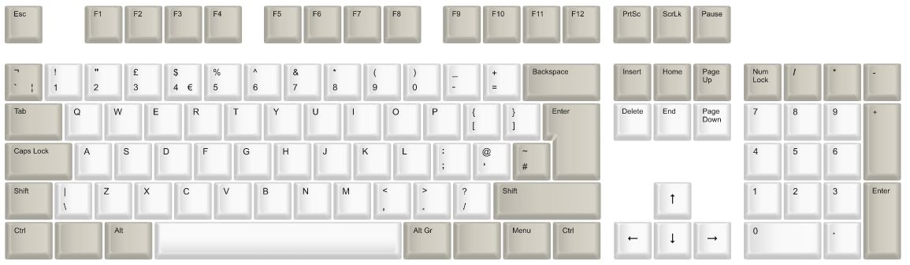
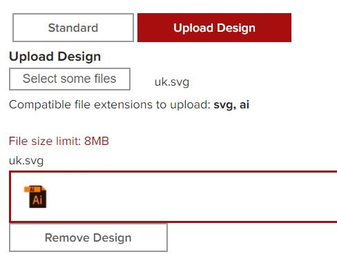
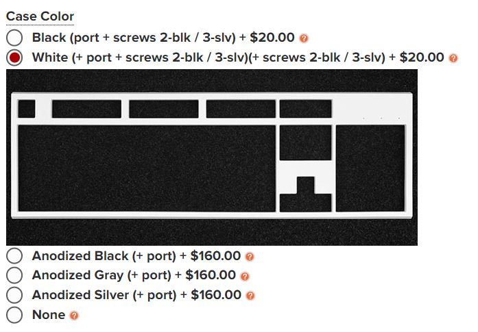
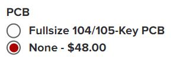
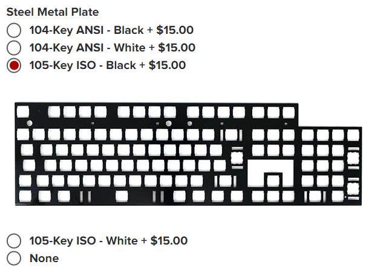
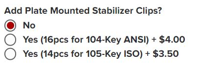

# Ordering From WASD

You need to order the keycaps and a keyboard kit from WASD

### Ordering Keycaps

You can use WASD's custom keycap printing service to print the keycaps required by your keyboard. 

The overall process is as follows

- Specify the color that you require for each keycap using a color template
- Upload a file which specifies the legends on each keycap

### Download the Inkscape file

Before you start, choose which regional layout you would prefer and download the Inkscape (.svg) from the inkscape\complete directory

https://github.com/grahamshaw1972/a2000Serotina/tree/main/inkscape/complete

### Choose the color of plastic for the keycaps

Go to the WASD custom keycap printing service:

https://www.wasdkeyboards.com/105-key-iso-custom-cherry-mx-keycap-set.html

Click NEXT >> to go to the Colors Tab

On this tab, you need to specify the plastic colour used for each of the keycaps. The default is for all keycaps to be black. The interface for this website is a little clunky. 

Click the Color White and select All Keys at the bottom. It will warn you "It looks like you may have picked the same color for text and cap." and the text color will be automatically changed to black. 

Next select The beige color next to white and select Modifiers at the bottom. This will update all of the Modifiers to be beige. 

Next, you need to update some of the keys individually, setting the color to beige in each case. Set the following keys to beige: ` and #

You also need to change some keycaps from beige to white. Click on the color white and select the following keys:  Delete, End, Page Down, Up, Left, Down Right

You should be aiming for a color template that looks like this: 

When you have got this, click on NEXT >> to go to the Legends tab.

### Upload the keycap Legend Design

Click on Upload Design. Choose the Inkscape (.svg) file that you download first. You should get positive confirmation that the design is included: 

Click **ADD TO CART**

That's all you need to do for the keycaps. 

### Add the Keyboard Kit to your Cart

The A2000 Serotina Keyboard has been designed to fit a case and a mounting plate from WASD keyboards. The link is here:

https://www.wasdkeyboards.com/wasd-v3-104-key-or-105-key-diy-kit.html

### Case Color

Go for white. 

### PCB

You don't need a PCB from WASD because you will be getting the PCB printed yourself.

### Steel Metal Plate

Choose 105-Key ISO - Black

**NB** - it's important that you choose 105-Key ISO and not 104-Key ANSI

### No Plate Mounted Stabilizer Clips

You don't need any Plate Mounted Stabilizer Clips.

You have now selected all the Kit options you require. Click **ADD TO CART**

### Buy Now

You now have both the keycaps and the keyboard kit in your Cart, so you can CHECKOUT. 

