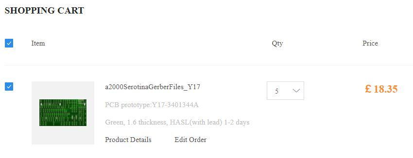
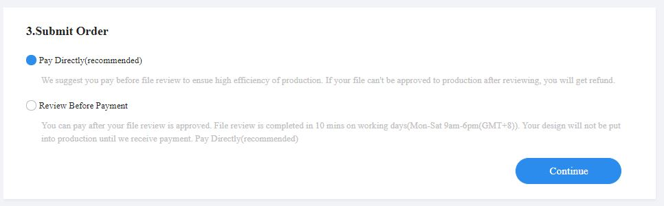

# Printing the PCB

The process for printing the PCB is simple. 

* Choose a PCB Printing Service
* Upload the Gerbers.zip file
* Choose Options
* Order

### Choose a PCB Printing Service

I usually go with JLCPCB because they provide good value for money. However please feel free to choose whichever PCB printing service you prefer. 

https://jlcpcb.com/

### Upload the Gerbers.zip file

Download the Gerbers.zip file from here:

https://github.com/grahamshaw1972/a2000Serotina/blob/main/a2000SerotinaGerberFiles.zip

On the JLCPCB website, click on the Add Gerber button: 

Navigate to the Gerbers.zip file that you downloaded.

It will take approx 30 seconds to process the Gerbers file once it's selected. 

### Choose Options

You should leave all of the options unchanged, with the exception of color. Choose whichever color you like:

### Save To Cart

Click **SAVE TO CART**

### Login

At this point, you will need to create an account or Log in if you already have an account. 

### View Cart

### Checkout

Select **Secure Checkout**

### Choose Shipping Method

Choose the Shipping method you prefer. 

### Payment Type

Choose whether to Pay before or after review. Paying Directly is quicker. 

Select how to Pay

Finally select **Pay**. Your PCBs should take a week or two to reach you. 
